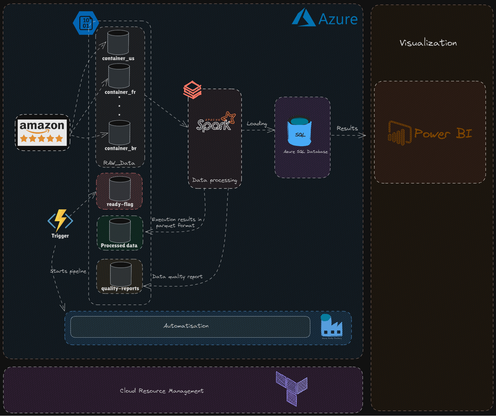

# iPhone 15 Review Analysis Project

## Overview

This project aims to analyze customer reviews of the iPhone 15 from different countries (USA, UK, Brazil, etc.) using a data engineering pipeline on **Azure**. The goal is to derive insights from customer sentiment, satisfaction with specific features (e.g., camera, battery), and inform targeted marketing campaigns.

### Key Business Goals:
- **Analyze customer sentiment by region** 🌍
- **Identify satisfaction with product features** (e.g., battery, camera) 🔋📷
- **Inform targeted marketing campaigns** 🎯

### Tools & Technologies Used:
- **Azure**: For cloud infrastructure and data processing
- **Databricks**: For sentiment analysis and feature extraction using NLP
- **Azure SQL Database**: For storing processed data
- **Azure Blob Storage**: For storing raw and processed data
- **Power BI**: For data visualization
- **Terraform**: For infrastructure as code

---

## Architecture

The following diagram illustrates the overall architecture of the pipeline:

---

## How the Pipeline Works:

### 1. Data Collection:
- Customer reviews of the iPhone 15 are scraped from Amazon websites (USA, UK, Brazil, etc.) using **Puppeteer** and stored in **JSON** format.

### 2. Data Storage:
- Raw data is stored in **Azure Blob Storage**. The processed data is stored in **Azure SQL Database**, and archived in **Parquet** format for optimization.

### 3. Data Processing & Analysis:
- The reviews are processed in **Databricks**. Sentiment analysis is performed using **Natural Language Processing (NLP)**, and machine learning is applied to classify the reviews into positive, neutral, or negative categories.

### 4. Automation with Azure Data Factory (ADF):
- **ADF** is used to automate the data pipeline, triggered by new files in **Blob Storage**. A **Data Factory Pipeline** processes the data and moves it through various stages of transformation.

### 5. Data Visualization:
- The results are visualized in **Power BI**, showcasing customer sentiment distribution by country, customer satisfaction with features, and more.

